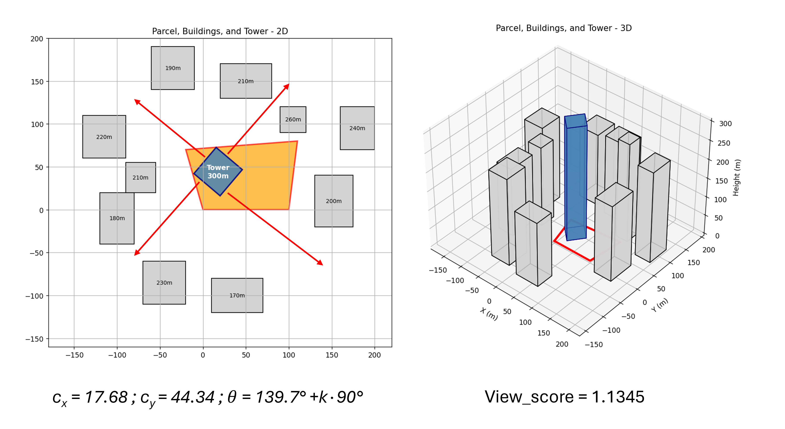
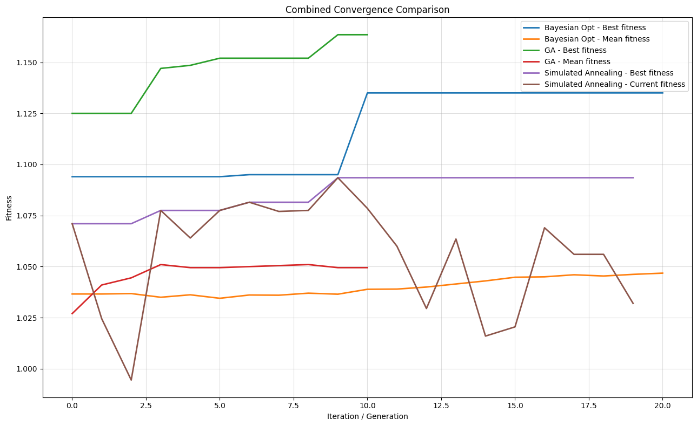

# View Score: View-Based Tower Placement Optimization in an Urban Environment

This project models a simplified urban design problem: **where should a high-rise tower be placed and rotated inside a parcel so that its windows achieve the best possible outward views?** Instead of optimizing only floor area or geometric fit, the project defines a quantitative **view score** based on the surrounding built environment and then uses search algorithms to find a better tower configuration.

The work combines **computational geometry, visibility analysis, objective-function design, and metaheuristic optimization**. The final result is a reproducible framework that evaluates candidate tower placements and compares several optimization strategies for improving façade view quality.

---

## Project Objective

The central goal of the project is to optimize the **position** and **orientation** of a rectangular tower inside a constrained parcel while considering the heights and locations of surrounding buildings.

More specifically, the project asks:

1. How can window quality be translated into a measurable score?
2. How can surrounding buildings be represented so that obstruction effects are computed automatically?
3. Which tower placement and rotation produce the highest average view quality?
4. How do different optimization methods compare on the same objective function?

This turns an architectural intuition into a computational optimization problem.

---

## Why This Problem Matters

In real estate and urban design, view quality has a strong effect on desirability and value. However, it is often discussed qualitatively rather than measured systematically. This project demonstrates how a spatial design question can be formulated as a data-driven objective:

- represent the parcel and neighboring buildings geometrically,
- discretize the tower façade into window patches,
- cast outward rays from windows,
- measure how quickly those rays intersect surrounding buildings,
- aggregate these local measurements into a global tower-level score.

The result is a framework that could be extended toward urban planning, generative design, site optimization, or decision support for conceptual architectural studies.

---

## Data and Environment Setup

The project does not rely on a tabular dataset. Instead, it creates a **synthetic spatial environment** consisting of:

- one irregular parcel polygon,
- multiple surrounding rectangular buildings,
- a candidate tower footprint with variable center coordinates and rotation,
- a fixed tower height during optimization runs.

The environment is created programmatically, with surrounding buildings defined by:

- `x`, `y` position,
- `width`,
- `depth`,
- `height`.

The parcel polygon and the neighboring building blocks define the feasible design context. fileciteturn2file1L1-L33 The tower itself is modeled as a rotated rectangle footprint plus a height parameter. 

---

## Conceptual Workflow

The full workflow is illustrated below.

The logic of the pipeline is:

1. Start from a 3D urban context or simplified site model.
2. Define a parcel and surrounding buildings.
3. Generate candidate tower placements inside the parcel.
4. Subdivide tower façades into windows.
5. Evaluate the visibility of each window using ray-based obstruction checks.
6. Aggregate those window-level scores into a single tower fitness value.
7. Search for the placement and rotation that maximize this score.

---

## Geometry and Feasibility Constraints

A candidate solution is defined by three main variables:

- `cx`: x-coordinate of tower center,
- `cy`: y-coordinate of tower center,
- `angle_deg`: tower rotation angle.

The tower is considered feasible only if **all footprint corners remain inside the parcel**. The project implements point-in-polygon and point-on-segment checks to enforce this geometric feasibility constraint during search.

This is important because the optimization is not allowed to propose visually good but physically invalid placements.

---

## View Scoring Logic

The project evaluates view quality by discretizing the vertical side faces of the tower into square window patches. For each window:

- the outward normal direction of the façade is computed,
- a ray is cast outward from the window,
- the nearest intersection with surrounding buildings is found,
- the distance to the first obstruction is translated into a score.

If no surrounding building is hit, the window receives a bonus score. If a building is hit, the score increases with distance and saturates according to an exponential function. This scoring behavior is implemented explicitly in the window scoring and tower fitness functions. 

At the tower level, the final **fitness** is the average score across all windows. 

This gives the project a clear and interpretable optimization target: **maximize the average view quality of all windows on the tower façade**.

---

## Optimization Methods

The project compares three search strategies on the same fitness function.

### 1. Genetic Algorithm
The GA creates an initial population of feasible tower placements, evaluates them, selects the best individuals, and generates new candidates through angle and position mutations. The implementation keeps the search inside the parcel and tracks both best and mean population fitness over generations. 

### 2. Simulated Annealing
Simulated annealing begins from one feasible candidate and proposes local neighbors by perturbing position and rotation. Worse solutions may be accepted with a temperature-controlled probability, which helps the search escape local optima. 

### 3. Bayesian Optimization
Bayesian optimization represents candidates in a continuous search space using `cx`, `cy`, and a sine-cosine encoding of rotation angle. It fits a Gaussian Process surrogate and chooses new candidates by maximizing Expected Improvement over a feasible candidate pool. 

The project also includes parameter sweep scripts for all three methods, which helps move beyond a single run and toward a more systematic comparison. 

---

## Example of an Optimized Layout

The figure below shows a representative optimized solution in both 2D and 3D.

This visualization highlights several important aspects:

- the parcel constraint,
- neighboring building heights,
- tower position and orientation,
- directional relationship between the tower and surrounding obstacles,
- the resulting aggregate `View_score`.

The search problem is therefore not purely abstract. The score corresponds to a concrete spatial arrangement that can be visualized and interpreted geometrically.

---

## Comparing Convergence Behavior

The convergence plot below compares the search dynamics of Bayesian Optimization, Genetic Algorithm, and Simulated Annealing.

This figure is useful because it does not only show the final score. It also shows how quickly each method improves and how stable its progression is:

- **Genetic Algorithm** reaches the highest best fitness among the displayed runs.
- **Bayesian Optimization** improves more steadily and reaches a competitive solution with a smaller number of high-value updates.
- **Simulated Annealing** explores more irregularly, reflecting its stochastic acceptance of worse intermediate states.

The codebase supports tracking best and mean fitness histories for GA and BO, and best/current fitness for SA, making this kind of side-by-side comparison possible. 

---

## How the Problem Was Solved

The problem was solved in five main stages.

### 1. Build the site geometry
A parcel polygon and a set of surrounding buildings were defined as a simplified urban environment. 

### 2. Define a feasible tower representation
The tower footprint was parameterized by center coordinates and rotation angle, then checked against parcel boundaries. 

### 3. Compute window-level visibility
The tower surface was discretized into windows, and each window cast a ray outward to detect the nearest blocking building. 

### 4. Aggregate local scores into a global objective
Window scores were converted into an average tower fitness value using a bounded distance-based formula. 

### 5. Optimize the design variables
Multiple search algorithms were applied to the same objective so that their solution quality and convergence behavior could be compared. 

---

## Main Findings

From the code and visual outputs, the main takeaways are:

- View quality can be translated into a measurable façade-level optimization target.
- A feasible tower placement problem can be handled with explicit geometric constraints rather than post-hoc filtering.
- Window-level ray scoring provides a natural bridge between spatial obstruction and optimization.
- Different search methods behave differently even on the same objective function: GA appears strongest in best-achieved score in the provided convergence comparison, while BO is competitive and more sample-efficient in spirit, and SA provides a simpler local-search baseline.
- Coarse window discretization can be used during search for speed, followed by finer re-evaluation for more precise final scoring. This coarse-to-fine strategy is explicitly implemented in the main optimization scripts. 

---

## Technical Components

### Geometry and simulation
- NumPy
- 2D parcel polygon representation
- Rotated rectangular tower footprint
- Axis-aligned surrounding buildings
- Point-in-polygon feasibility testing
- Ray-box intersection for visibility checks

### Visualization
- Matplotlib
- 2D site plots
- 3D site plots
- Convergence comparison charts

### Optimization
- Genetic Algorithm
- Simulated Annealing
- Bayesian Optimization with Gaussian Process surrogate

### Scoring
- Window-level obstruction scoring
- Tower-level average fitness aggregation

---

## Limitations

This project is a strong prototype, but it simplifies several aspects of real urban design.

- Buildings are represented as simple rectangular volumes.
- The scoring uses only direct obstruction distance, not sunlight, privacy, wind, noise, or skyline semantics.
- Tower dimensions are fixed during the optimization runs shown in the main scripts.
- The environment is synthetic rather than derived from GIS, BIM, or cadastral data.
- The fitness objective is single-objective, whereas real design problems often balance view, density, regulation, cost, and structural constraints at the same time.

These limitations are acceptable for a portfolio project because the core contribution is the computational framework and optimization logic.

---

## Future Improvements

Potential extensions include:

- importing real 3D site geometry from GIS, LiDAR, or mesh data,
- optimizing additional variables such as tower width, depth, or height,
- incorporating sunlight exposure and shadow analysis,
- adding multi-objective optimization,
- weighting windows differently by floor, façade, or unit value,
- introducing more advanced visibility metrics such as skyline openness or directional quality,
- validating results against architectural or real-estate heuristics.

---

## Repository Structure

This repository includes components for:

- environment generation,
- tower geometry creation,
- visibility computation,
- scoring,
- Genetic Algorithm search,
- Simulated Annealing search,
- Bayesian Optimization search,
- parameter sweeps and tuning scripts,
- 2D/3D visualization.

The three main entry scripts demonstrate how the optimization methods are run in practice for the same site context. 
